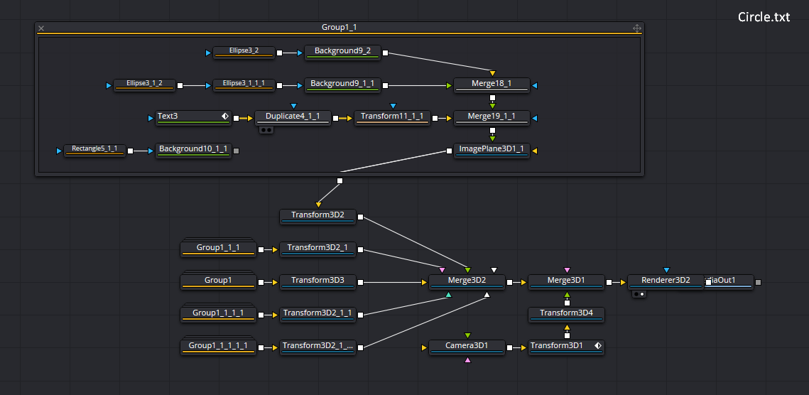
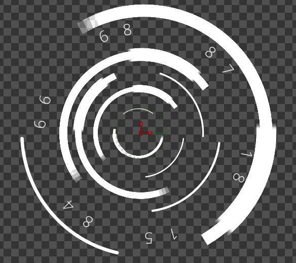

# DavinciResolve

## Fingerprint HUD

Just copy all the text in Fingerprints.txt file and paste into the fusion working space of the Davinci Resolve. After it, by double clicking the "Fingerprint" and "_3fingerprint" nodes, change the location of image file to your respective path to image of fingerprint. The image of fingerprint is also given above. The link to the image is https://pixabay.com/photos/fingerprint-traces-pattern-456483/

For complete description watch timelapse at https://youtu.be/JjBZ8LPAHEM

## Circles HUD
Just copy all the text in AnimatedEllipses.txt file and paste into the fusion working space of the Davinci Resolve to get the animated ellipses much without keyframing (Only at one node which can also be changed to expression). You can experiment your own way after double clicking Group nodes. See nodes for visualisation below along with the image, these will produce. 

